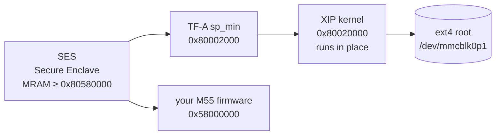

# Config B2 — SD-card root filesystem, MRAM reserved for M55 firmware

The stock DevKit-E7 Linux layout puts everything in MRAM: TF-A, the device tree, the
XIP kernel **and** a cramfs root filesystem. Together they leave roughly **561 KB** of the
5,767,168-byte application region free — not enough for a useful M55 application.

Config B2 moves the root filesystem to an SD card. MRAM then holds only TF-A, the DTB and
the kernel, and **2,505,888 B** is free for M55 firmware — a 4.5× increase.

Linux still boots exactly as before: no bootloader, no U-Boot. TF-A `sp_min` jumps
straight into the XIP kernel in MRAM, which then mounts its root from the SD card.

## MRAM budget

| region | stock (cramfs in MRAM) | Config B2 |
|---|---:|---:|
| TF-A `bl32.bin` @ `0x80002000` | 30,144 | 30,144 |
| device tree @ `0x80010000` | 33,536 | 33,536 |
| XIP kernel @ `0x80020000` | 3,108,944 | 3,108,944 |
| cramfs root @ `0x80380000` | 1,998,848 | — *(on SD)* |
| ATOC package | ~21,000 | ~21,000 |
| **free for M55 images** | **~561,000** | **2,505,888** |

2,505,888 B holds **18** images of 138,800 B with 7,488 B to spare.

## Boot chain



SES releases the cores according to the ATOC. TF-A is the only entry with a boot flag for
A32_0; the DTB and kernel are data-only entries that TF-A jumps to.

## 1. Build

```sh
git clone <this repo> && cd alif_linux-apss-build-setup
./scripts/fetch-layers.sh
ROOTFS_ON_SD=1 source scripts/setup.sh
bitbake alif-tiny-image
```

`ROOTFS_ON_SD=1` adds the `apss-sd-boot` distro feature. That is a **stock BSP feature**
(defined in `linux-alif.inc`) that no distro enables by default. It pulls in
`sd_boot.cfg`, which supplies the SDHCI/MMC drivers and:

```
CONFIG_CMDLINE="console=ttyS0,115200n8 root=/dev/mmcblk0p1 rootfstype=ext4 rootwait rw loglevel=9"
CONFIG_CMDLINE_FORCE=y
```

`CONFIG_CMDLINE_FORCE=y` makes the kernel ignore whatever `bootargs` the device tree
carries, so the stock DTB is used unmodified — no device-tree patching is required.

`SMP=1` is the default in this repo and brings up both A32 cores. See
[`meta-e7-smp/README.md`](../meta-e7-smp/README.md) for the TF-A fix that makes SMP work.

Artifacts land in `tmp-glibc/deploy/images/devkit-e7/`:

| file | purpose |
|---|---|
| `bl32.bin` | TF-A `sp_min` |
| `devkit-e7.dtb` | device tree |
| `xipImage` | the kernel, executed in place from MRAM |
| `alif-tiny-image-devkit-e7.ext4` | root filesystem for the SD card |

## 2. Prepare the SD card

One ext4 partition, written with the image built above. **Check the device node first** —
writing to the wrong disk destroys it.

```sh
diskutil list                                    # identify the card, e.g. /dev/disk4
diskutil unmountDisk /dev/disk4
sudo dd if=alif-tiny-image-devkit-e7.ext4 of=/dev/rdisk4s1 bs=4m status=progress
sync
```

The kernel expects the root on the **first partition** (`/dev/mmcblk0p1`).

## 3. Provision MRAM

Create an ATOC configuration listing the three Linux images plus **your own M55
firmware**. This is where the freed space gets used:

```json
{
    "APSS-BL32": {
        "binary": "bl32.bin",
        "version": "1.0.0",
        "signed": true,
        "cpu_id": "A32_0",
        "mramAddress": "0x80002000",
        "flags": ["boot"]
    },
    "APSS-DTB": {
        "binary": "devkit-e7.dtb",
        "version": "1.0.0",
        "signed": true,
        "cpu_id": "A32_0",
        "mramAddress": "0x80010000"
    },
    "APSS-XIP": {
        "binary": "xipImage",
        "version": "1.0.0",
        "signed": true,
        "cpu_id": "A32_0",
        "mramAddress": "0x80020000"
    },
    "MY-M55-HE-APP": {
        "binary": "my_app_he.bin",
        "version": "1.0.0",
        "signed": true,
        "cpu_id": "M55_HE",
        "loadAddress": "0x58000000",
        "flags": ["load", "boot"]
    }
}
```

There is deliberately **no `APSS-ROOTFS` entry** — that is the whole point. Keeping a
cramfs entry costs you 1,998,848 B and the kernel will ignore it anyway.

M55 entries use `loadAddress` and `flags: ["load", "boot"]`: SES copies the image from
MRAM into the core's memory and releases it. The A32 entries use `mramAddress` with no
load flag, because the kernel runs in place. Build the M55 binaries with the Alif SDK as
usual; addresses come from your SDK linker configuration.

Then, from the SETOOLS directory:

```sh
./app-gen-toc -f build/config/my-config.json -o build/MyAppTocPackage.bin -v
./app-write-mram -p -c /dev/cu.usbmodem21301
```

Two things will save you a bad afternoon:

- **`app-write-mram` takes no package argument.** It burns whatever `app-gen-toc` left as
  active state. Always run `app-gen-toc` *last*, then read back the `[INFO] Burning:` line
  and confirm it names exactly the files you intended.
- **Never write at or above `0x80580000`.** That is SE firmware and the system TOC.
  `app-gen-toc` reports `Available MRAM:` — for Config B2 it should say `2505888`.

If a bad package leaves the board unresponsive, recover with Hard Maintenance Mode: start
`./maintenance -c <port> -b 55000`, wait for `Waiting for Target..[RESET Platform]`, then
press the physical RESET button. The tool must already be waiting when you press.

## 4. Verify

A healthy Config B2 boot looks like this:

```
INFO:    HyperRAM configured successfully
NOTICE:  SP_MIN: v2.1(debug):e18dde23-dirty
Booting Linux on physical CPU 0x0
smp: Brought up 1 node, 2 CPUs
SMP: Total of 2 processors activated (400.00 BogoMIPS).
mmc0: new high speed SDHC card at address 59b4
mmcblk0: mmc0:59b4 USDU1 15.0 GiB
 mmcblk0: p1
VFS: Mounted root (ext4 filesystem) on device 179:1.
devkit-e7 login:
```

From a shell on the board:

```
# nproc
2
# grep -c processor /proc/cpuinfo
2
# grep arch_timer /proc/interrupts
 20:      24350      24350     GIC-0  27 Level     arch_timer
```

Equal, advancing `arch_timer` counts on both columns are the real SMP proof — the CNTVOFF
bug this repo fixes shows up precisely as the two cores disagreeing about time.

Confirm the SD root is genuinely writable, not just mounted:

```
# mount | grep ' / '
/dev/root on / type ext4 (rw,relatime)
# touch /tmp/wtest && ls -l /tmp/wtest
-rw-r--r--    1 root root 0 Jan 1 00:04 /tmp/wtest
```

Note that this image ships **no `/root` directory** — `poky-tiny` omits it. `touch
/root/anything` fails with `No such file or directory` until you `mkdir -p /root`. That is
an empty-image quirk, not a read-only filesystem.

## Status of this configuration

| claim | evidence |
|---|---|
| Boots to `login:` with SMP and ext4 root on SD | verified on hardware, repeatedly |
| Both A32 cores active | `nproc` = 2; `arch_timer` 24350 on CPU0 **and** CPU1 |
| SD root is writable | `/dev/root on / type ext4 (rw,relatime)`; `touch` succeeds |
| 2,505,888 B free for M55 | `app-gen-toc` reported `Available MRAM: 2505888` |
| HyperRAM configured and sized at 32 MiB | verified; full 32 MiB zero-pattern sweep clean |
| `ROOTFS_ON_SD=1` / `apss-sd-boot` build path | verified end to end — fresh clone, fresh build directory, 1502/1502 tasks, burned and booted |

That last row was an open caveat until it was built and booted from a clean checkout of this
branch. The check that matters is the pair below: the **deployed device tree still asks for
cramfs**, while the running kernel takes the SD command line from `CONFIG_CMDLINE_FORCE`.

```
# deployed devkit-e7.dtb, decompiled — unmodified, md5 0b68b640…
bootargs = "console=ttyS0,115200n8 root=mtd:physmap-flash.0 rootfstype=cramfs ro loglevel=9";

# and on the console at boot:
Kernel command line: console=ttyS0,115200n8 root=/dev/mmcblk0p1 rootfstype=ext4 rootwait rw loglevel=9
EXT4-fs (mmcblk0p1): mounted filesystem with ordered data mode.
VFS: Mounted root (ext4 filesystem) on device 179:1.
devkit-e7 login:
```

The DTB is byte-identical to the stock one the BSP produces. Nothing edits it.

## Why not a compressed kernel?

A `zImage` would be ~1.16 MB smaller than the `xipImage` and free that much more MRAM. It
does not work on this platform, for a reason worth recording:

**SES scans application-image bytes and hangs when it finds a gzip signature.** Five stock
`zImage` packages wedged the Secure Enclave — no TF-A output, A32_0 never released, SE
unresponsive on the ISP port. Zeroing the two signature bytes `1f 8b` at offset `0x3084`
of that same binary made SES release A32_0 normally. An LZ4-compressed `zImage`, which
contains no gzip signature anywhere, was likewise accepted and ran TF-A to completion.

A second, unrelated problem remains: the decompressor never reaches Linux when the
`zImage` lives in MRAM. That is a kernel build question — `CONFIG_ZBOOT_ROM` exists
precisely because a stock `zImage` assumes it was loaded into writable RAM — and it has
not been solved.

Until it is, the XIP kernel is the supported configuration.
